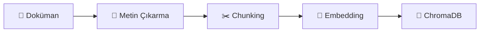
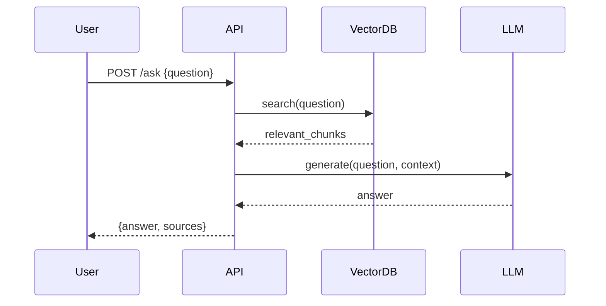
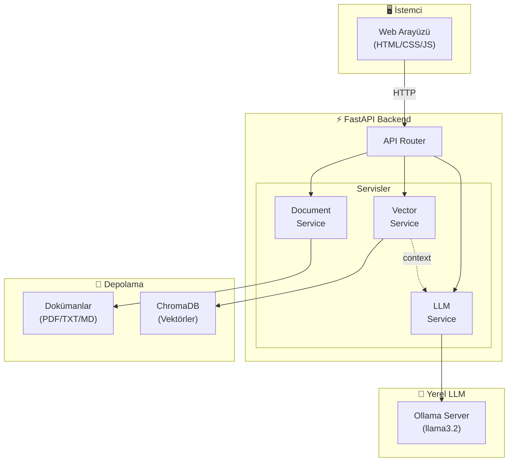

# Yerel LLM ile Doküman Soru-Cevap Servisi
## Teknik Sunum

---

# 1. Problem Tanımı

## Kullanıcı İhtiyacı

Günümüzde birçok kurum ve birey, büyük miktarda dokümana sahip olmasına rağmen bu dokümanlardan hızlıca bilgi çıkarmak konusunda zorluk yaşamaktadır.

**Temel Sorunlar:**
- 📚 Dokümanlar arasında manuel arama zaman alıcı
- 🔒 Hassas veriler bulut servislerine yüklenemez
- 💰 Ticari API'ler maliyet oluşturur
- 🌐 İnternet bağlantısı gerektiren çözümler her zaman kullanılamaz

## Çözüm Yaklaşımı

Bu servis, **RAG (Retrieval-Augmented Generation)** yaklaşımını kullanarak:

1. **Yerel Çalışma**: Tüm işlemler kullanıcının bilgisayarında gerçekleşir
2. **Semantik Arama**: Anahtar kelime yerine anlam bazlı arama
3. **Bağlam Destekli Cevap**: LLM, sadece ilgili doküman parçalarını kullanarak cevap üretir
4. **Kolay Kullanım**: Web arayüzü ile teknik bilgi gerektirmeden kullanım

---

# 2. LLM ile İletişim Katmanı

## Teknoloji Seçimi: Ollama

| Alternatif | Avantajları | Dezavantajları |
|------------|-------------|----------------|
| **Ollama** ✓ | Kolay kurulum, OpenAI uyumlu API | Model boyutları büyük |
| LM Studio | GUI desteği | API kısıtlı |
| HuggingFace Transformers | Esneklik | Kurulum karmaşık |

**Ollama Tercihi Nedenleri:**
- Tek komutla model indirme
- REST API ile kolay entegrasyon
- Düşük bellek optimizasyonları

## Modül Yapısı

```python
# app/services/llm_service.py
class LLMService:
    def check_connection(self) -> bool
    def is_model_available(self) -> bool
    def generate_response(question, context) -> str
```

## Prompt Mühendisliği

RAG için optimize edilmiş sistem prompt'u:
- Bağlam bilgisini zorunlu kılar
- Türkçe cevap üretimi için yönlendirir
- Kaynak belirtme kuralları tanımlar

---

# 3. Doküman İşleme ve Vektör Veritabanı

## Doküman İşleme Pipeline



## Desteklenen Formatlar

| Format | Kütüphane | Özellikler |
|--------|-----------|------------|
| PDF | PyMuPDF | Hızlı, güvenilir |
| TXT/MD | Built-in | UTF-8 desteği |
| DOCX | python-docx | Paragraf bazlı |

## Chunking Stratejisi

```python
# Parametreler
chunk_size = 500 karakter
chunk_overlap = 50 karakter
```

**Neden Overlap?**
- Cümle bütünlüğünü korur
- Bağlam kaybını önler

## Vektör Veritabanı: ChromaDB

**Tercih Nedenleri:**
- Python-native, ek servis gerektirmez
- Kalıcı depolama (persist)
- Cosine similarity desteği

## Embedding Modeli

**all-MiniLM-L6-v2** (Sentence-Transformers)
- 384 boyutlu vektörler
- Hızlı inference
- Çok dilli destek

---

# 4. API / Servis Katmanı

## Teknoloji: FastAPI

**Neden FastAPI?**
- ⚡ Async/await desteği
- 📚 Otomatik OpenAPI dokümantasyonu
- ✅ Pydantic ile tip güvenliği
- 🧪 Kolay test edilebilirlik

## Endpoint'ler

| Endpoint | Metod | Açıklama |
|----------|-------|----------|
| `/api/health` | GET | Servis durumu |
| `/api/ask` | POST | Soru-cevap |
| `/api/upload` | POST | Doküman yükleme |
| `/api/documents` | GET | Doküman listesi |

## Request/Response Akışı



## Hata Yönetimi

- 400: Geçersiz istek (boş soru, yanlış format)
- 404: Kaynak bulunamadı
- 503: LLM servisi kullanılamıyor
- 500: Beklenmeyen sunucu hatası

---

# 5. Genel Çalışma Mimarisi



## Veri Akışı

### Doküman Yükleme
1. Kullanıcı dosya seçer
2. API dosyayı alır, doğrular
3. DocumentService metni çıkarır
4. Metin chunk'lara ayrılır
5. VectorService embedding oluşturur
6. ChromaDB'ye kaydedilir

### Soru Sorma
1. Kullanıcı soru yazar
2. Soru embedding'e dönüştürülür
3. ChromaDB'de benzer chunk'lar aranır
4. En alakalı chunk'lar seçilir
5. LLM'e soru + context gönderilir
6. Cevap kullanıcıya döndürülür

---

# 6. Literatür Araştırması

## Kaynaklar

### RAG Yaklaşımı
- [Retrieval-Augmented Generation for Knowledge-Intensive NLP Tasks](https://arxiv.org/abs/2005.11401) - Lewis et al., 2020
- [LangChain Documentation](https://python.langchain.com/)

### Vektör Veritabanları
- [ChromaDB Documentation](https://docs.trychroma.com/)
- [FAISS vs ChromaDB Comparison](https://medium.com/)

### Yerel LLM
- [Ollama Documentation](https://ollama.ai/)
- [LM Studio vs Ollama](https://github.com/)

## Karşılaştırmalı Analiz

### Vektör Veritabanı Seçimi

| Özellik | ChromaDB | FAISS | Pinecone |
|---------|----------|-------|----------|
| Kurulum | ✅ Kolay | ⚠️ Orta | ⚠️ Bulut |
| Kalıcılık | ✅ Var | ❌ Manuel | ✅ Var |
| Maliyet | ✅ Ücretsiz | ✅ Ücretsiz | ❌ Ücretli |
| Ölçeklenebilirlik | ⚠️ Orta | ✅ Yüksek | ✅ Yüksek |

**ChromaDB Tercihi**: Proje ölçeğinde yeterli, kurulumu kolay, Python-native.

### Embedding Modeli Seçimi

| Model | Boyut | Hız | Kalite |
|-------|-------|-----|--------|
| all-MiniLM-L6-v2 | 384 | ✅ Hızlı | ⚠️ İyi |
| all-mpnet-base-v2 | 768 | ⚠️ Orta | ✅ Yüksek |
| OpenAI Ada | 1536 | ❌ API | ✅ Yüksek |

**MiniLM Tercihi**: Hız/kalite dengesi, yerel çalışma, yeterli performans.

## Öğrenilen Dersler

1. **Chunk boyutu kritik**: Çok küçük → bağlam kaybı, çok büyük → gürültü
2. **Overlap önemli**: Cümle sınırlarını korumak için gerekli
3. **Prompt mühendisliği**: RAG için özel prompt tasarımı şart
4. **Hata yönetimi**: LLM timeout'ları ve bağlantı kopmaları için hazırlıklı olunmalı

---

# Sonuç

Bu proje, yerel LLM ve RAG yaklaşımını bir araya getirerek:

✅ **Gizlilik**: Veriler kullanıcının bilgisayarında kalır  
✅ **Maliyet**: Ücretsiz, açık kaynak araçlar  
✅ **Esneklik**: Farklı modeller ve yapılandırmalar  
✅ **Kullanılabilirlik**: Web arayüzü ile kolay erişim  

sağlamaktadır.

---

**Hazırlayan**: [İsim]  
**Tarih**: Şubat 2026
