# Local LLM Document Question-Answering Service
## Technical Presentation

---

# 1. Problem Definition

## User Need

Today, many organizations and individuals have large amounts of documents but struggle to quickly extract information from them.

**Core Problems:**
- 📚 Manual document search is time-consuming
- 🔒 Sensitive data cannot be uploaded to cloud services
- 💰 Commercial APIs create costs
- 🌐 Solutions requiring internet are not always available

## Solution Approach

This service uses the **RAG (Retrieval-Augmented Generation)** approach to:

1. **Local Processing**: All operations happen on the user's computer
2. **Semantic Search**: Meaning-based search instead of keyword matching
3. **Context-Aware Answers**: LLM generates answers using only relevant document sections
4. **Easy to Use**: Web interface requires no technical knowledge

---

# 2. LLM Communication Layer

## Technology Choice: Ollama

| Alternative | Advantages | Disadvantages |
|-------------|------------|---------------|
| **Ollama** ✓ | Easy setup, OpenAI-compatible API | Large model sizes |
| LM Studio | GUI support | Limited API |
| HuggingFace Transformers | Flexibility | Complex setup |

**Why Ollama:**
- Single command model download
- Easy REST API integration
- Low memory optimizations

## Module Structure

```python
# app/services/llm_service.py
class LLMService:
    def check_connection(self) -> bool
    def is_model_available(self) -> bool
    def generate_response(question, context) -> str
```

## Prompt Engineering

System prompt optimized for RAG:
- Requires context information
- Guides response generation
- Defines source citation rules

---

# 3. Document Processing and Vector Database

## Document Processing Pipeline

```mermaid
flowchart LR
    A["📄 Document"] --> B["📖 Text Extraction"]
    B --> C["✂️ Chunking"]
    C --> D["🔢 Embedding"]
    D --> E["💾 ChromaDB"]
```



## Supported Formats

| Format | Library | Features |
|--------|---------|----------|
| PDF | PyMuPDF | Fast, reliable |
| TXT/MD | Built-in | UTF-8 support |
| DOCX | python-docx | Paragraph-based |

## Chunking Strategy

```python
# Parameters
chunk_size = 500 characters
chunk_overlap = 50 characters
```

**Why Overlap?**
- Preserves sentence integrity
- Prevents context loss

## Vector Database: ChromaDB

**Why ChromaDB:**
- Python-native, no additional service required
- Persistent storage
- Cosine similarity support

## Embedding Model

**all-MiniLM-L6-v2** (Sentence-Transformers)
- 384-dimensional vectors
- Fast inference
- Multilingual support

---

# 4. API / Service Layer

## Technology: FastAPI

**Why FastAPI?**
- ⚡ Async/await support
- 📚 Automatic OpenAPI documentation
- ✅ Type safety with Pydantic
- 🧪 Easy testability

## Endpoints

| Endpoint | Method | Description |
|----------|--------|-------------|
| `/api/health` | GET | Service status |
| `/api/ask` | POST | Question-answering |
| `/api/upload` | POST | Document upload |
| `/api/documents` | GET | Document list |

## Request/Response Flow


## Error Handling

- 400: Invalid request (empty question, wrong format)
- 404: Resource not found
- 503: LLM service unavailable
- 500: Unexpected server error

---

# 5. Overall Architecture

```mermaid
flowchart TB
    subgraph Client["🖥️ Client"]
        UI["Web Interface<br/>(HTML/CSS/JS)"]
    end

    subgraph Backend["⚡ FastAPI Backend"]
        Router["API Router"]
        
        subgraph Services["Services"]
            DocSvc["Document<br/>Service"]
            VecSvc["Vector<br/>Service"]
            LLMSvc["LLM<br/>Service"]
        end
    end

    subgraph Storage["💾 Storage"]
        Files["Documents<br/>(PDF/TXT/MD)"]
        Chroma["ChromaDB<br/>(Vectors)"]
    end

    subgraph LLM["🤖 Local LLM"]
        Ollama["Ollama Server<br/>(llama3.1:8b)"]
    end

    UI -->|"HTTP"| Router
    Router --> DocSvc
    Router --> VecSvc
    Router --> LLMSvc

    DocSvc --> Files
    VecSvc --> Chroma
    LLMSvc --> Ollama

    VecSvc -.->|"context"| LLMSvc
```



## Data Flow

### Document Upload
1. User selects file
2. API receives and validates file
3. DocumentService extracts text
4. Text is split into chunks
5. VectorService creates embeddings
6. Saved to ChromaDB

### Asking Questions
1. User types question
2. Question converted to embedding
3. Similar chunks searched in ChromaDB
4. Most relevant chunks selected
5. Question + context sent to LLM
6. Answer returned to user

---

# 6. Literature Review

## Sources

### RAG Approach
- [Retrieval-Augmented Generation for Knowledge-Intensive NLP Tasks](https://arxiv.org/abs/2005.11401) - Lewis et al., 2020
- [LangChain Documentation](https://python.langchain.com/)

### Vector Databases
- [ChromaDB Documentation](https://docs.trychroma.com/)
- [FAISS vs ChromaDB Comparison](https://medium.com/)

### Local LLM
- [Ollama Documentation](https://ollama.ai/)
- [LM Studio vs Ollama](https://github.com/)

## Comparative Analysis

### Vector Database Selection

| Feature | ChromaDB | FAISS | Pinecone |
|---------|----------|-------|----------|
| Setup | ✅ Easy | ⚠️ Medium | ⚠️ Cloud |
| Persistence | ✅ Yes | ❌ Manual | ✅ Yes |
| Cost | ✅ Free | ✅ Free | ❌ Paid |
| Scalability | ⚠️ Medium | ✅ High | ✅ High |

**ChromaDB Choice**: Sufficient for project scale, easy setup, Python-native.

### Embedding Model Selection

| Model | Dimensions | Speed | Quality |
|-------|------------|-------|---------|
| all-MiniLM-L6-v2 | 384 | ✅ Fast | ⚠️ Good |
| all-mpnet-base-v2 | 768 | ⚠️ Medium | ✅ High |
| OpenAI Ada | 1536 | ❌ API | ✅ High |

**MiniLM Choice**: Speed/quality balance, local operation, sufficient performance.

## Lessons Learned

1. **Chunk size is critical**: Too small → context loss, too large → noise
2. **Overlap is important**: Necessary to preserve sentence boundaries
3. **Prompt engineering**: Special prompt design is essential for RAG
4. **Error handling**: Must be prepared for LLM timeouts and connection drops

---

# Conclusion

This project combines local LLM and RAG approach to provide:

✅ **Privacy**: Data stays on user's computer  
✅ **Cost**: Free, open source tools  
✅ **Flexibility**: Different models and configurations  
✅ **Usability**: Easy access via web interface  

---

**Prepared by**: [Name]  
**Date**: February 2026
